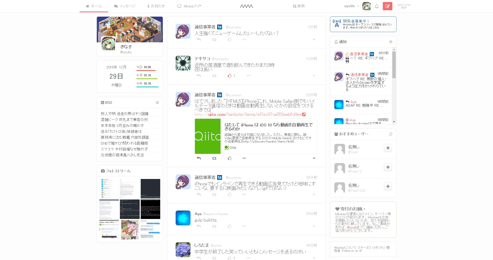

================================================================

[![][travis-badge]][travis-link]
[![][dependencies-badge]][dependencies-link]
[![][himawari-badge]][himasaku]
[![][sakurako-badge]][himasaku]
[![][agpl-3.0-badge]][AGPL-3.0]

[Misskey](https://misskey.xyz) is a completely open source,
ultimately sophisticated new type of mini-blog based SNS.

Key features
----------------------------------------------------------------
* Automatically updated timeline
* Private messages
* Two-Factor Authentication support
* ServiceWorker support
* Web API for third-party applications
* No ads

and more! You can touch with your own eyes at https://misskey.xyz/.

Setup and Installation
----------------------------------------------------------------
If you want to run your own instance of Misskey,
please see [Setup and installation guide](./docs/setup.en.md).

Contribution
----------------------------------------------------------------
Please see [Contribution guide](./CONTRIBUTING.md).

Release Notes
----------------------------------------------------------------
Please see [ChangeLog](./CHANGELOG.md).

Sponsors & Backers
----------------------------------------------------------------
Misskey has no 100+ GitHub stars currently. However, a donation is always welcome!
If you want to donate to Misskey, please get in touch with [@syuilo][syuilo-link].

**Note:** When you donate to Misskey, your name will be listed in [donors](./DONORS.md).

Collaborators
----------------------------------------------------------------
| ![syuilo][syuilo-icon] | ![Morisawa Aya][ayamorisawa-icon] | ![otofune][otofune-icon]        |
|------------------------|-----------------------------------|---------------------------------|
| [syuilo][syuilo-link]  | [Aya Morisawa][ayamorisawa-link]  | [otofune][otofune-link] |

[List of all contributors](https://github.com/syuilo/misskey/graphs/contributors)

Copyright
----------------------------------------------------------------
Misskey is an open-source software licensed under [The MIT License](LICENSE).

The portions of Misskey contributed by Akihiko Odaki <nekomanma@pixiv.co.jp> is
licensed under GNU Affero General Public License (only version 3.0 of the
license is applied.) See Git log to identify them.

[agpl-3.0]:           https://www.gnu.org/licenses/agpl-3.0.en.html
[agpl-3.0-badge]:     https://img.shields.io/badge/license-AGPL--3.0-444444.svg?style=flat-square
[travis-link]:        https://travis-ci.org/syuilo/misskey
[travis-badge]:       http://img.shields.io/travis/syuilo/misskey/master.svg?style=flat-square
[dependencies-link]:  https://david-dm.org/syuilo/misskey
[dependencies-badge]: https://img.shields.io/david/syuilo/misskey.svg?style=flat-square
[himasaku]:           https://himasaku.net
[himawari-badge]:     https://img.shields.io/badge/%E5%8F%A4%E8%B0%B7-%E5%90%91%E6%97%A5%E8%91%B5-1684c5.svg?style=flat-square
[sakurako-badge]:     https://img.shields.io/badge/%E5%A4%A7%E5%AE%A4-%E6%AB%BB%E5%AD%90-efb02a.svg?style=flat-square

<!-- Collaborators Info -->
[syuilo-link]:      https://syuilo.com
[syuilo-icon]:      https://avatars2.githubusercontent.com/u/4439005?v=3&s=70
[ayamorisawa-link]: https://github.com/ayamorisawa
[ayamorisawa-icon]: https://avatars0.githubusercontent.com/u/10798641?v=3&s=70
[otofune-link]:     https://github.com/otofune
[otofune-icon]:     https://avatars0.githubusercontent.com/u/15062473?v=3&s=70
